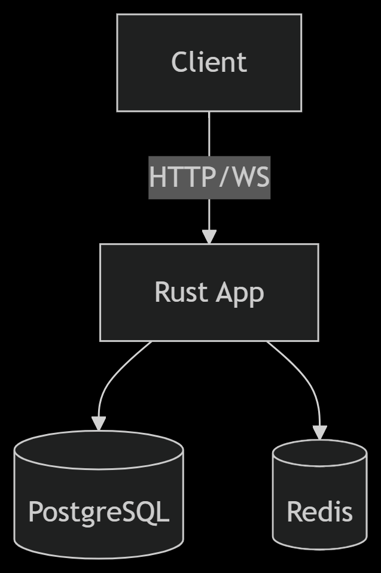

# 🚀 Axum-Rust Web Service with Auth & WebSockets

- A high-performance backend service built with Rust Axum featuring JWT authentication, role-based access control, real-time WebSocket communication, and Redis/PostgreSQL integration.

## 🌟 Features

### 🔐 Secure Authentication
- JWT-based user registration & login
- Password hashing (argon2)
- Middleware-protected routes
- Role-based access control (User, Admin)
- Claims validation for endpoint security

### 🛡️ Protected CRUD Operations
- Full user management (Create, Read, Update, Delete)
- Input validation with `validator::Validate`
- Structured error responses
- Role-guarded endpoints

### 📡 Real-Time WebSockets
- Token-authenticated connections
- Session management with Redis
- Type-safe message handling (`serde`)
- Graceful disconnection handling
- Async message processing

### 🗃️ Data Storage
- **PostgreSQL** for relational data
- **Redis** for:
  - Session storage
  - Pub/Sub (future-ready)
  - Cache management

## 🛠️ Tech Stack

| Component       | Technology              |
|-----------------|-------------------------|
| Framework       | Axum                    |
| Async Runtime   | Tokio                   |
| Database        | PostgreSQL + SQLx       |
| Cache           | Redis                   |
| Auth            | JWT + Argon2            |
| Validation      | validator crate         |
| Containerization| Docker                  |
| Load Balancer   | Nginx                   |

## 🚀 Getting Started

### Prerequisites
- Rust 1.70+
- Docker & Docker Compose
- Ngnix
- PostgreSQL 15
- Redis 7

### Installation
```bash
# Clone the repository
git clone https://github.com/your-repo/axum-webservice.git
cd axum-webservice

# Set up environment variables
cp .env.example .env
```

## Download **open_llama_3b-f16.bin** Model 

[Download Link](https://huggingface.co/rustformers/open-llama-ggml/blob/main/open_llama_3b-f16.bin)

- Then place the model inside base project Dir where Cargo.toml is.

> You must have docker if you intend to run it locally, 

### Running with Docker
```bash
docker-compose up -d --build
```
### To to build and rebuild your app.
```
docker-compose down && docker-compose up -d --build
```

*** OR ***
### Running Locally

```bash
cargo run
```

### To start redis on docker 
```
docker run -d --name redis -p 6379:6379 redis
```
### To remove redis from docker
```
docker rm -f redis
```
### Manual Setup
```
# Install dependencies
cargo build

# Run migrations
sqlx migrate run

# Start server
cargo run --release
```
### 📚 API Documentation
| Method | Endpoint         | Description       | Auth Required | Payload | Condition | 
| ------ | ---------------- | ----------------- | ------------- | ------------- |------------- |
| POST   | `/localhost:8055/auth/register` | User registration | No            | 	{"firstName":"user_A_firstname", "lastName":"user_A_lastname","password":"user_A_123","username":"user_A_username","email":"user_A_@gmail.com", "gender":"Male","telephone":"+234901xxxxxxxx","country":"Country","city":"City"} | All fields require |
| POST   | `/localhost:8055/auth/login`    | User login        | No            | 	{"password":"user_A_123", "username":"user_A_username","email":"user_A_@gmail.com", } | Password and {email or username} | 
| GET    | `/localhost:8055/users`         | List users        | Admin and Users | - |-|
| PUT    | `/localhost:8055/users/:id`     | Update user       | Admin and Users |-  |-| 
| DELETE    | `/localhost:8055/users/:id`     | Delete user    | Admin and Users |-  |-| 
| Websocket  | `ws:/localhost:9001/ws/`     | Prompt user    | Admin and Users |{"token":"", "prompt":"What is HTML?", "type":"ai_request"}  |-| 

### WebSocket Protocol
```
// Connection Init
{"type":"start_connection","token":"jwt.token.here"}

// AI Request
{"type":"ai_request","prompt":"Hello"}

// Disconnect
{"type":"disconnect","session_id":"uuid-here"}
```
### ⚖️ Load Balancing with Nginx & Docker Compose
- This service uses Nginx as a reverse proxy and load balancer to distribute traffic across multiple backend instances for better scalability and fault tolerance.
  - The setup is orchestrated via Docker Compose, running:
    - Multiple instances of the Rust Axum service on different ports
    - An Nginx container configured with least_conn strategy to balance requests
    - Shared Redis and PostgreSQL services across all app instances

- Example Nginx upstream configuration:
```bash
upstream ai_web_assistant {
    least_conn;
    server 127.0.0.1:8055;
    server 127.0.0.1:8056;
    server 127.0.0.1:8057;
}

server {
    listen 80;
    location / {
        proxy_pass http://ai_web_assistant;
        proxy_set_header Host $host;
        proxy_set_header X-Real-IP $remote_addr;
    }
}
```
- This will automatically spin up the backend instances, Nginx load balancer, Redis, and PostgreSQL.

### 🐳 Docker Architecture




    
### 🔧 Configuration
```
DATABASE_URL=postgres://user:pass@db:5432/app
REDIS_URL=redis://redis:6379
JWT_SECRET=your_secure_secret
```
### 📜 License
> Distributed under the MIT License.
